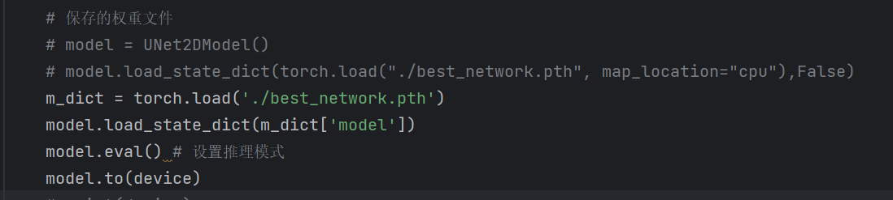

# Model-saving-and-loading

pytorch保存模型非常简单，主要有两种方法：

只保存参数；（官方推荐）

保存整个模型 (结构+参数)。

torch.save( )实现对网络结构和模型参数的保存。有两种保存方式：
**一是保存整个神经网络的的结构信息和模型参数信息，save的对象是网络模型。我们可以理解为保存的是整个模型文件；**

**二是只保存神经网络的训练模型权重等参数，save的对象是net.state_dict( )。我们可以理解为保存的是模型的状态文件**。

假设我有一个训练好的模型名叫net1,则

torch.save(net1, ‘7-net.pth’) # 保存整个神经网络的结构和模型参数

torch.save(net1, ‘7-net.pkl’)  # 同上

torch.save(net1.state_dict(), ‘7-net_params.pth’) # 只保存神经网络的模型参数

torch.save(net1.state_dict(), ‘7-net_params.pkl’)  # 同上

如果你是使用torch.save方法来进行模型参数的保存，那保存文件的后缀其实没有任何影响，结果都是一样的，很多.pkl的文件也是用torch.save保存下来的，和.pth文件一模一样的。不管pkl文件还是pth文件，都是以二进制形式存储的，没有本质上的区别，你用pickle这个库去加载pkl文件或pth文件，效果都是一样的。

由于保存整个模型将耗费大量的存储，故官方推荐**只保存参数**，然后在建好模型的基础上加载。

一、只保存模型参数

`torch.save(model.state_dict(), path)`

特别地，如果还想保存某一次训练采用的优化器、epochs等信息，可将这些信息组合起来构成一个字典，然后将字典保存起来：

`state = {'model': model.state_dict(), 'optimizer': optimizer.state_dict(), 'epoch': epoch}`

`torch.save(state, path)`

二、加载模型的参数

`model.load_state_dict(torch.load(path))`

以大字典形式保存

`checkpoint = torch.load(path)`

`model.load_state_dict(checkpoint['model'])  相当于大字典里面的一个小字典`  

`optimizer.load_state_dict(checkpoint['optimizer'])  相当于大字典里面的一个小字典`

`epoch = checkpoint(['epoch'])  相当于大字典里面的一个小字典`

三、实战应用

**一般加载模型/模型参数都写在模型即将训练之前**

**一般保存模型/模型参数都写在打印模型loss之后**

四、补充

如果需要保存/加载整个模型

`torch.save(model, path)`

`model = torch.load(path)`

五、易错点提示

如果模型保存的时候将模型参数和优化器参数一并保存了。保存格式为字典套字典的格式。如下：

而调用模型的时候只需要加载模型参数model.state_dict()，也就是大字典里面的其中一个小字典。直接调用模型保存路径就会报错。

需要将代码改为：

六、参考

Reference: https://www.jianshu.com/p/1cd6333128a1
